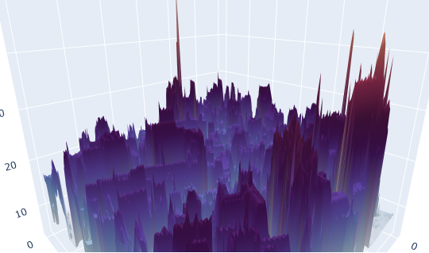
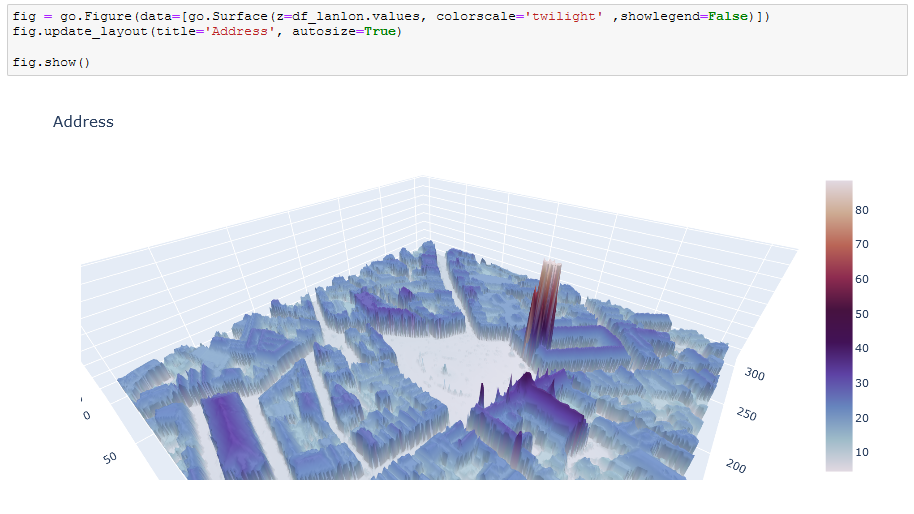

# 3D_house_project
Solo project python pandas matplotlib

PROGRESS

Friday 6/11/20 
-going over the project case
-installing and figuring out pycharm pro

Monday 9/11/20
-installing geopandas
-creating virtual environment in conda
-installing Descartes and Gdal..
-Readme and info about the gov data
-tutorials on geopandas etc
-Installing RasterIO
-creating notebook and trying out first plots based on Geotiff

Tuesday 10/11/20
-solving Git problems. 
-Relative paths.
-submitting project to google form.
-Researching shape files and zooming in on RasterIO
-color maps
-RAM problems
-found Bruges on the tiffs
-windows of RasterIO

Thursday 12/11/20
-Window method of RasterIO
-https://www.youtube.com/watch?v=kJXUUO5M4ok tutorial
-https://www.youtube.com/watch?v=3kj8uoOlwjg tutorial
-decided to read the whole RasterIO Docs
-bounding box around lambert coordinates.

Friday 13/11/20
-Reprojection with RasterIO
-georasters tiff to pandas df (unsuccesful)
-3D plot with matplotlib
-3D plot with plotly

Monday 16/11/20
-Conversion from Lambert to EPSG:4326
-Latlon librairy - code? (abandoned)
-reprojection RasterIO

Tuesday 17/11/20
-put everything in a new notebook asking for input
-smoothing options for plotly
-transformer pyproj
-researched Techtalk a bit
-smoothed with simple y axis operation

Wednesday 18/11/20
-convert DMS to DD
-write python script
-GUI exploration
-Spike trouble again!

Thursday 19/11/20
- Dash?
-pysimplegui research
-matching pycharm with conda env
-notebook to .py
-Finished with the GUI
-Readme and submitting project

## Table of contents
* [General info](#general-info)
* [Screenshots](#screenshots)
* [Technologies](#technologies)
* [Setup](#setup)
* [Features](#features)
* [Status](#status)
* [Contact](#contact)

## General info
The purpose of the project is to show a nice 3D plot with a bounding box around a certain DMS coördinate. This Beta version can plot in the region around Bruges. A possible add on is the whole of Belgium.

## Screenshots

Gotham look                                                     
:---------------------------------------------------------------
  
 
 
Grote markt
:-------
 

## Technologies

* Python
* Plotly
* Jupyter notebook
* PySimpleGui
* pycharm

## Setup
You can clone or fork this repository and test the files. You need a Geotif file named DHMVIIDSMRAS1m_k13 that is located at the following URL; http://www.geopunt.be/download?container=dhm-vlaanderen-ii-dsm-raster-1m&title=Digitaal%20Hoogtemodel%20Vlaanderen%20II,%20DSM,%20raster,%201m

Place it in the same directory as the python script called '3DHouse_Maarten'.

## Features
The product features are as follow:

1. GUI for input.
2. Address title, DMS coördinates and bounding box input
3. transforming coördinates from DMS to Belgian lambert.
4. Plotly plot zoomable and rotates.

## Status
Challenge is: finished, final version.

## Contact
Created by [@Maarten-Vandaele](www.github.com/Maarten-Vandaele) - feel free to contact me!

